# Vet-AI

FastAPI service for **veterinary diagnosis** (sklearn RandomForest), **continuous learning** from clinician feedback, **multi-phase MLAir pipeline integration**, **MLOps** (MLflow, optional S3 artifacts), and **Prometheus** metrics.

---

## Overview

Vet-AI exposes a REST API consumed by the Spring **genai-service** (and similar clients). It loads trained models from disk, runs inference on structured visit features, logs predictions and feedback to **PostgreSQL** for retraining, and can promote models per clinic (multi-tenant) or globally.

| Topic | Description |
|-------|-------------|
| Inference | `POST /predict` -- symptoms and visit features -> ranked diagnoses |
| Feedback | `POST /continuous-training/feedback` -- accept/reject + final diagnosis for training |
| Training | In-process or **EKS/K8s** job (`scripts/train_eks.py`) -- see `docker/Dockerfile.training` |
| MLAir Pipeline | Multi-phase DAG: `data_prep -> model_train -> validation -> persist` |
| Registry | Active model pins, MLflow runs, optional champion/challenger under `/mlops/v2` |

OpenAPI docs: **`GET /docs`** (Swagger UI) when the app is running.

---

## Architecture

### Multi-phase training pipeline (MLAir integration)

When triggered via the MLAir control plane, training is split into 4 independent tasks within a single pipeline run. Each task executes sequentially (DAG dependency), and intermediate state is persisted to a session directory so each phase can run as a separate process.

```mermaid
sequenceDiagram
    participant SCH as MLAir Scheduler
    participant EX as MLAir Executor
    participant RUN as mlair_ext_runner
    participant VAI as Vet-AI
    participant API as MLAir API

    Note over SCH: Run triggered with DAG:<br/>data_prep -> model_train -> validation -> persist

    SCH->>EX: Redis: task data_prep (plugin=vetai_data_prep)

    rect rgb(40, 40, 60)
    Note over EX,VAI: Phase 1 -- Data Prep
    EX->>RUN: stdin JSON (context + run_id)
    RUN->>VAI: POST /mlops/mlair/data-prep-invoke
    VAI-->>RUN: phase_job_id, session_id
    loop Poll phase-status
        RUN->>VAI: GET /mlops/mlair/phase-status
        VAI-->>RUN: progress_pct, current_phase
        RUN->>API: POST /runs/{rid}/metrics
    end
    RUN-->>EX: stdout JSON
    EX->>SCH: task_finished SUCCESS
    end

    SCH->>EX: Redis: task model_train (plugin=vetai_model_train)

    rect rgb(40, 60, 40)
    Note over EX,VAI: Phase 2 -- Model Train
    EX->>RUN: stdin JSON
    RUN->>VAI: POST /mlops/mlair/model-train-invoke
    Note over VAI: Load session from Phase 1
    loop Poll phase-status
        RUN->>VAI: GET /phase-status
        RUN->>API: POST /runs/{rid}/metrics
    end
    RUN-->>EX: stdout JSON
    EX->>SCH: task_finished SUCCESS
    end

    SCH->>EX: Redis: task validation (plugin=vetai_validation)

    rect rgb(60, 40, 40)
    Note over EX,VAI: Phase 3 -- Validation
    EX->>RUN: stdin JSON
    RUN->>VAI: POST /mlops/mlair/validation-invoke
    Note over VAI: Regression gate + feedback gate
    loop Poll phase-status
        RUN->>VAI: GET /phase-status
        RUN->>API: POST /runs/{rid}/metrics
    end
    RUN-->>EX: stdout JSON
    EX->>SCH: task_finished SUCCESS
    end

    SCH->>EX: Redis: task persist (plugin=vetai_persist)

    rect rgb(50, 50, 40)
    Note over EX,VAI: Phase 4 -- Persist
    EX->>RUN: stdin JSON
    RUN->>VAI: POST /mlops/mlair/persist-invoke
    Note over VAI: Save model, S3, MLflow, MLAir sync
    loop Poll phase-status
        RUN->>VAI: GET /phase-status
        RUN->>API: POST metrics + params + artifacts
    end
    Note over VAI: Cleanup session
    RUN-->>EX: stdout JSON (model_uri)
    EX->>SCH: task_finished SUCCESS
    end

    SCH->>API: run status = SUCCESS
```



### Training phases detail

| Phase | Endpoint | What it does | Progress |
|-------|----------|--------------|----------|
| **data_prep** | `POST /mlops/mlair/data-prep-invoke` | Download CSV from MLAir, parse, collect training data, preprocess features, class diversity check | 0-100% |
| **model_train** | `POST /mlops/mlair/model-train-invoke` | RandomForest fit (warm-start fine-tune or full retrain), probability calibration | 0-100% |
| **validation** | `POST /mlops/mlair/validation-invoke` | Golden-set regression gate, feedback improvement gate | 0-100% |
| **persist** | `POST /mlops/mlair/persist-invoke` | Save model to disk, S3 upload, MLflow log, MLAir model registry sync | 0-100% |

Session state between phases is stored in `/tmp/training_sessions/<run_id>/` using `joblib` (numpy/sklearn objects) and JSON (metadata). The persist phase cleans up the session directory after completion.

### Direct training flow (non-MLAir)

For feedback-triggered or manual training without the MLAir pipeline, the monolithic `execute_training()` function runs all phases in a single call:


---

## Repository layout

```text
vet-ai/
├── ai_service/
│   ├── app/
│   │   ├── api/
│   │   │   ├── routers/
│   │   │   │   ├── predict.py          # POST /predict inference
│   │   │   │   ├── training.py         # Continuous training, CSV bootstrap, phase execution helpers
│   │   │   │   ├── mlops.py            # MLOps endpoints, MLAir webhooks, multi-phase pipeline endpoints
│   │   │   │   ├── mlops_v2.py         # Champion-challenger workflow
│   │   │   │   ├── models.py           # Model management
│   │   │   │   └── health.py           # Health probes
│   │   │   ├── deps.py                 # Auth dependencies
│   │   │   └── middleware/
│   │   │       └── request_id.py       # X-Request-ID middleware
│   │   ├── domain/
│   │   │   ├── schemas/                # Pydantic models (predict, training, mlops)
│   │   │   └── services/
│   │   │       ├── training_service.py # Core training logic + multi-phase functions
│   │   │       ├── training_session.py # Session state persistence between pipeline phases
│   │   │       ├── inference_service.py
│   │   │       ├── clinic_scope_service.py
│   │   │       └── clinic_catalog_service.py
│   │   ├── infrastructure/
│   │   │   ├── external/
│   │   │   │   ├── mlair_client.py     # MLAir API client (registry, tracking, pipeline config)
│   │   │   │   ├── mlflow_client.py    # MLflow integration
│   │   │   │   ├── s3_client.py        # S3 artifact upload
│   │   │   │   └── customers_client.py # Spring customers-service client
│   │   │   ├── storage/
│   │   │   │   └── model_store.py      # Disk model registry, active model pins
│   │   │   └── persistence/
│   │   │       └── postgres.py         # PostgreSQL connection
│   │   ├── core/                       # Settings, logging, auth, Prometheus metrics
│   │   ├── mlops/                      # Drift detection, monitoring, champion-challenger
│   │   └── main.py                     # FastAPI app entrypoint + MLAir bootstrap
│   ├── models/                         # Trained model artifacts (v1/, v2/, clinics/)
│   └── tests/
├── docker/
│   ├── Dockerfile.api
│   └── Dockerfile.training
├── scripts/                            # Training and helper scripts
├── monitoring/                         # Monitoring assets
├── requirements.txt
└── pyproject.toml
```

---

## Features

- **Inference** with per-request latency and confidence; optional **clinic-scoped** active model.
- **Multi-phase MLAir pipeline**: `data_prep -> model_train -> validation -> persist` as 4 separate DAG tasks with real-time progress tracking.
- **Continuous training**: policy thresholds, job history, CSV bootstrap (admin), feedback pool (GLOBAL vs CLINIC_ONLY).
- **Quality gates**: golden-set regression gate (F1 tolerance), feedback improvement gate (accuracy/F1 comparison).
- **Postgres** persistence for predictions, feedback, and training jobs (`DATABASE_URL`).
- **MLflow** experiment tracking (`MLFLOW_TRACKING_URI`).
- **MLAir integration**: model registry sync, pipeline orchestration, real-time progress metrics.
- **Prometheus**: `/metrics` (via `prometheus-fastapi-instrumentator`) plus custom counters/histograms in `ai_service/app/core/metrics.py`.
- **Multi-tenant**: clinic-scoped models, per-clinic training policies, global fallback.

---

## Related repositories

| Repository | Role |
|------------|------|
| [vet-microservices](https://github.com/DoAnCN-NguyenTaiPhu-TranMinhNhat/vet-microservices) | Spring Cloud stack; **genai-service** proxies diagnosis and training to Vet-AI. Contains MLAir docker-compose profile, custom plugins, and executor runner. |
| [vet-microservices-config](https://github.com/DoAnCN-NguyenTaiPhu-TranMinhNhat/vet-microservices-config) | Central Spring configuration for the Java services. |
| [ml-air](https://github.com/phu142857/ml-air) | MLAir control plane (API, scheduler, executor, frontend). |

Typical local layout (sibling folders):

```text
DACN/
├── vet-ai/                    # this repo
├── vet-microservices/         # docker-compose builds vet-ai from ../vet-ai
├── vet-microservices-config/
└── WORK/ml-air/               # MLAir source (for local image builds)
```

---

## Requirements

- **Python 3.11** (see `docker/Dockerfile.api`)
- **PostgreSQL** for continuous training / feedback
- **MLflow** server (optional but recommended for experiment tracking)
- **Docker** or **Podman** (optional) -- images: `docker/Dockerfile.api`, `docker/Dockerfile.training`

Install dependencies:

```bash
cd vet-ai
pip install -r requirements.txt
```

---

## Configuration (environment variables)

### Environment files

| File | Purpose | Loaded automatically? |
|------|---------|----------------------|
| **`.env.example`** | Committed template with full variable set and defaults. | No -- copy to `.env` and edit |
| **`.env`** | Your local secrets and overrides (gitignored). | No -- export in your shell or use `set -a && source .env && set +a` before `uvicorn` |

In Docker, **`vet-microservices`** Compose injects variables via **`vet-microservices/.env`** for the `vet-ai` service.

### Key variables

| Variable | Purpose |
|----------|---------|
| `DATABASE_URL` | PostgreSQL DSN for predictions, feedback, training jobs. |
| `ADMIN_TOKEN` | Bearer token for admin routes. |
| `MODEL_DIR` / `MODEL_ROOT_DIR` | Paths to loaded model artifacts. |
| `MLFLOW_TRACKING_URI` | MLflow server URL (e.g. `http://mlflow:5000`). |
| `MLAIR_API_BASE_URL` | MLAir API URL (e.g. `http://mlair-api:8080`). |
| `MLAIR_API_TOKEN` | Bearer token for MLAir API. |
| `MLAIR_TENANT_ID` | MLAir tenant (default: `default`). |
| `MLAIR_PROJECT_GLOBAL` | Global project ID for MLAir. |
| `MLAIR_TRAINING_INVOKE_TOKEN` | Auth token for inbound MLAir pipeline webhooks. |
| `TRAINING_WINDOW_DAYS` | Rolling window for eligible feedback (days). |

---

## Docker

**API image** (`docker/Dockerfile.api`):

```bash
docker build -t vet-ai:latest -f docker/Dockerfile.api .
docker run --rm -p 8000:8000 \
  -e DATABASE_URL=postgresql://... \
  -e ADMIN_TOKEN=... \
  vet-ai:latest
```

In **vet-microservices**, `docker-compose.yml` builds this repo as service `vet-ai`:

```bash
cd vet-microservices
docker compose --profile mlair up -d --build vet-ai
```

---

## API map

| Prefix / path | Description |
|----------------|-------------|
| `POST /predict` | Main diagnosis inference. |
| `GET /health`, `/readyz`, `/livez` | Health probes. |
| `GET /model/info`, `/models/versions` | Loaded model metadata. |
| `POST /models/active` | Switch active model (admin). |
| `/continuous-training/*` | Config, eligibility, feedback, prediction logging, training trigger/history, CSV bootstrap. |
| `/mlops/mlair/data-prep-invoke` | Phase 1: data collection + preprocessing (MLAir pipeline). |
| `/mlops/mlair/model-train-invoke` | Phase 2: model fitting + calibration (MLAir pipeline). |
| `/mlops/mlair/validation-invoke` | Phase 3: regression + feedback gates (MLAir pipeline). |
| `/mlops/mlair/persist-invoke` | Phase 4: model save + sync (MLAir pipeline). |
| `/mlops/mlair/phase-status` | Poll phase job progress (used by executor runner). |
| `/mlops/mlair/dataset-train-invoke` | Legacy single-task training trigger (kept for backward compatibility). |
| `/mlops/mlair/training-invoke` | Feedback-based training trigger from MLAir. |
| `/mlops/mlair/promote-webhook` | Inbound model promote webhook from MLAir. |
| `/mlops/*` | Registry, drift, monitoring, config. |
| `/mlops/v2/*` | Champion-challenger workflow (admin). |
| `GET /metrics` | Prometheus scrape endpoint. |

---

## Training modes

1. **MLAir multi-phase pipeline** -- triggered via MLAir control plane. Training is split into 4 DAG tasks (`data_prep -> model_train -> validation -> persist`), each running as a separate executor task with real-time progress tracking. Session state is persisted between phases.
2. **In-process** -- triggered via API (`/continuous-training/training/trigger`) inside the same FastAPI process, suitable for dev/small workloads.
3. **EKS / Kubernetes Job** -- when `ALLOW_EKS_HYBRID_TRAINING` is enabled; see `scripts/train_eks.py`.
4. **CSV bootstrap** -- admin uploads CSV via `/continuous-training/training/bootstrap-csv` or MLAir triggers via `/mlops/mlair/dataset-train-invoke`.

After successful training, feedback rows are **marked consumed** (ineligible for immediate retrain) rather than deleted.

---

## MLAir pipeline plugins

Custom plugins registered via `vet-microservices/mlair/custom_plugins/`:

| Plugin | Entry point | Used by |
|--------|-------------|---------|
| `vetai_data_prep` | `VetAiDataPrepPlugin` | Phase 1: data collection + preprocessing |
| `vetai_model_train` | `VetAiModelTrainPlugin` | Phase 2: model fitting + calibration |
| `vetai_validation` | `VetAiValidationPlugin` | Phase 3: quality gates |
| `vetai_persist` | `VetAiPersistPlugin` | Phase 4: model save + sync |
| `vetai_train_from_dataset_version` | `VetAiTrainFromDatasetVersionPlugin` | Legacy single-task training |
| `vetai_train_invoke` | `VetAiTrainInvokePlugin` | Feedback-based training |

---

## Observability

- **Prometheus** metrics include inference latency, request counts, feedback counters, training job gauges (see `ai_service/app/core/metrics.py`).
- **MLAir UI** shows real-time pipeline task timeline with per-task progress bars.
- **MLflow** tracks experiment runs, metrics, and model artifacts.

---

## Testing

```bash
pytest
```

---

## License

This project is part of a veterinary clinic microservices codebase. Use and distribution terms should match your organization's policy.

---

## Contributing

Issues and pull requests: use your team's GitHub workflow on [DoAnCN-NguyenTaiPhu-TranMinhNhat/vet-ai](https://github.com/DoAnCN-NguyenTaiPhu-TranMinhNhat/vet-ai).
